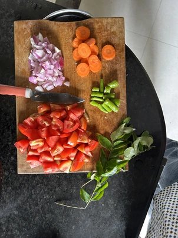

+++
title = 'Festivals, Family, Friends & Food'
date = 2024-01-16T22:37:17+05:30
draft = false
+++

Picture of veggies that I cut. How the call with dad is longer than usual. Had a topic to talk about. Till now, i always thought i can buy food - like i should mom this much amount for her “services”. But, I am realizing that its an activity and pretty common one at it. I can have a lot of discussions around this topic with almost anyone. Learn from them. Share my experiences. I wanna slowly "learn" this essential skill. Wait a min, rather than looking at it as a skill why not look at it as a fun activity, like badminton. Thats interesting!

I am starting to like the vibe of festivals lately. We get holidays. Everyone gather around - friends, family who are now in different states, find one common time to come around and talk! Its like one free block of time in everyone's calendar. 

Went out to watch *Kodi Pandaalu* with Surya & Sai. And this is the first time I saw it in live. And its pretty brutal. I didn't like the vibe at all. Felt bad for those animals! After that we came home and played UNO on our terrace. We had so much fund and laughter. This took us back to COVID lockdown days. We three used to gather around and play a lot of UNO in Surya's home. Good old days. 

All in all a pretty great day!

